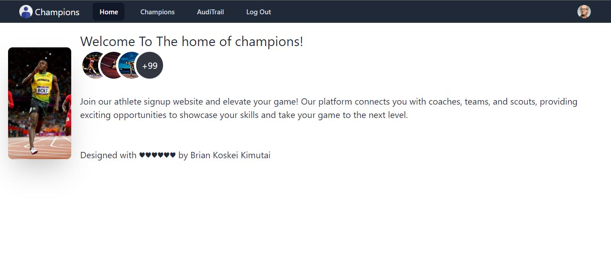

## Athlethe Champions app
## By Brian Kimutai Koskei
## Screenshot
 
 ## Table of Content
 - [Description](#description)
 - [Landing Page](#Landing-Page)
 - [Requirement](#Requirements)
 - [Installation Process](#installation-Process)
 - [Live Link](#Live-Link)
 - [Technology  Used](#technology-Used)
 - [Licence](#licence)
 - [Authors Info](#Authors-Info)
 ## Description
 
This is a straightforward UI-driven driven website for Athlethes to connect with each other,it has fully intergrated JWT  authentication ,.It allows users to create account, login ,reset password,modify users and also has an audit trail to track every activity taking place in the system.

## Landing page
This is a beutiful page notifying the users to keep visiting the page to get more exciting experience since the page is still under development .
[Go Back to the top](#Screenshot)

[Go Back to the top](#Screenshot)

 ###  Requirements
 * Access to  a computer or any other accessory such as a phone
 * Access to internet
 
 ### Installation Process
 ****
* Clone to this repo : git clone git@github.com:borebrian2021/mern-authentication-project.git
* Unzip the downloaded files in a folder of choice .
* Open the terminal and run npm install in client and server folder.
* Run npm run dev on frontend and also in backend.
 ****
 [Go Back to the top](#Screenshot)
### Live Link
- Yet to be hosted.
### Technology  Used
* HTML - which was used to develope the structure off the pages.
* React Library-Used to buld the entire application.
* TailwindCSS - which was used to style the User Interface.
* DaisyUI - which works with combination of Tailwind to used to create all the components of the UI.
* Node Js- Used to build all the endpoints API.

## Licence
MIT License
Copyright (c) [2022] [Brian Kimutai]
Permission is hereby granted, free of charge, to any person obtaining a copy
of this software and associated documentation files (the "Software"), to deal
in the Software without restriction, including without limitation the rights
to use, copy, modify, merge, publish, distribute, sublicense, and/or sell
copies of the Software, and to permit persons to whom the Software is
furnished to do so, subject to the following conditions:
The above copyright notice and this permission notice shall be included in all
copies or substantial portions of the Software.
THE SOFTWARE IS PROVIDED "AS IS", WITHOUT WARRANTY OF ANY KIND, EXPRESS OR
IMPLIED, INCLUDING BUT NOT LIMITED TO THE WARRANTIES OF MERCHANTABILITY,
FITNESS FOR A PARTICULAR PURPOSE AND NONINFRINGEMENT. IN NO EVENT SHALL THE
AUTHORS OR COPYRIGHT HOLDERS BE LIABLE FOR ANY CLAIM, DAMAGES OR OTHER
LIABILITY, WHETHER IN AN ACTION OF CONTRACT, TORT OR OTHERWISE, ARISING FROM,
OUT OF OR IN CONNECTION WITH THE SOFTWARE OR THE USE OR OTHER DEALINGS IN THE
SOFTWARE.
[Go Back to the top](#Screenshot)
## Authors Info
Linkedin - [Brain Koskei Kimutai](https://www.linkedin.com/in/bore-brian-5655b814b/)
Phone   - +254712035642
Email   - bkimutai2021@gmail.com